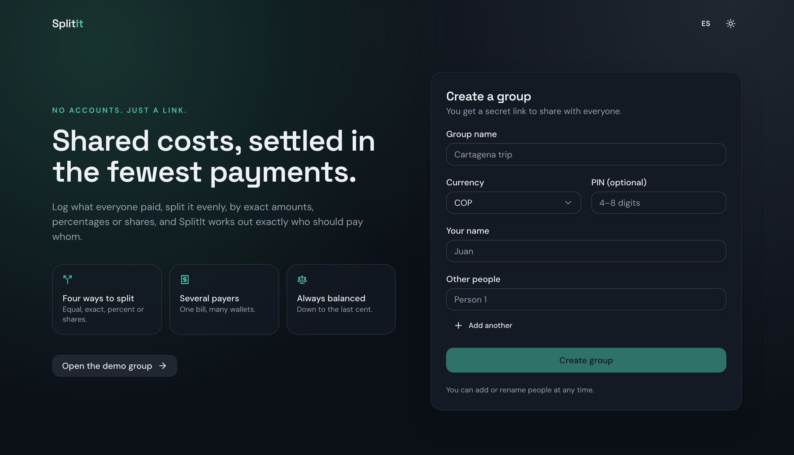
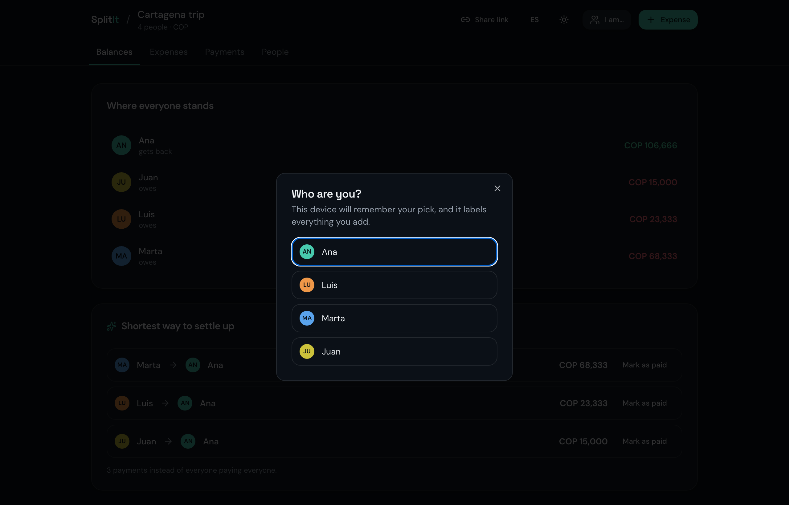
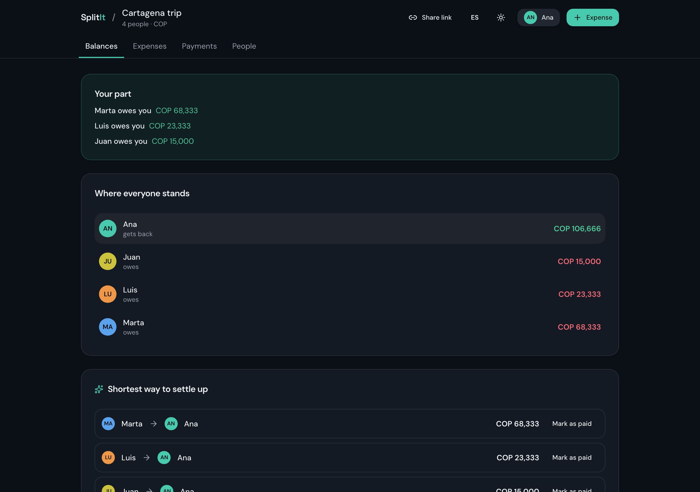
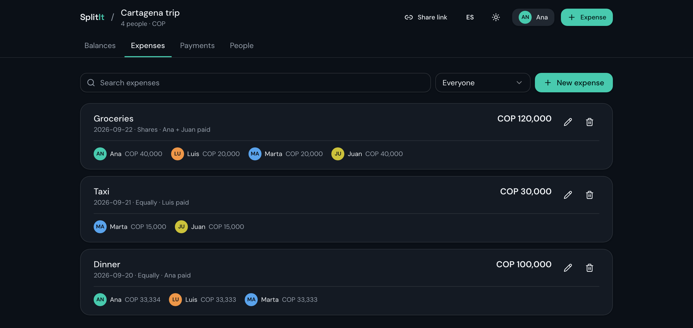
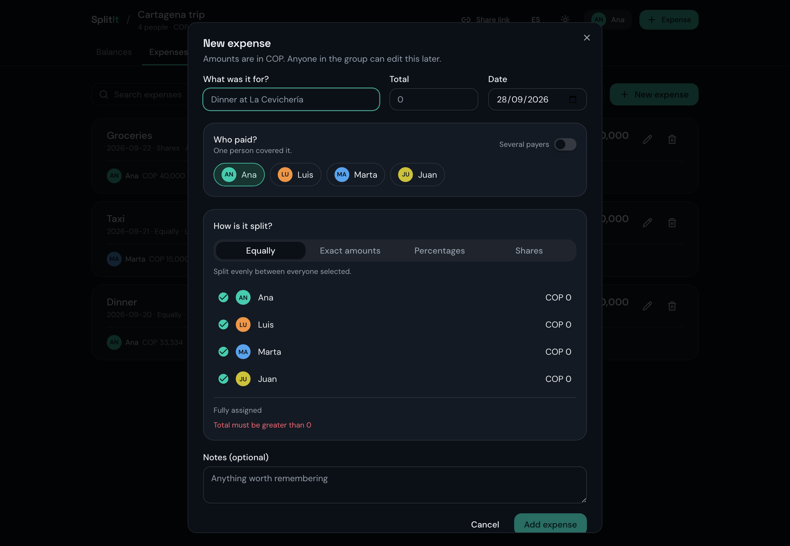
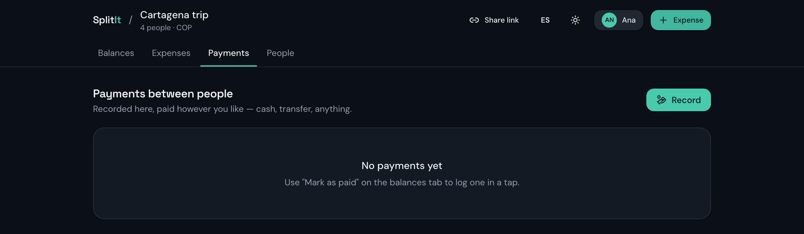
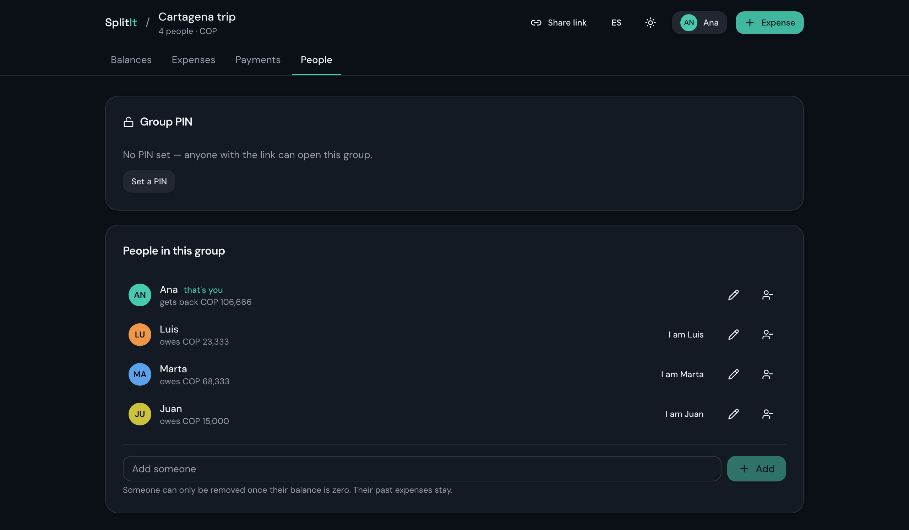

# SplitIt

SplitIt is a web app for splitting shared expenses in a group. Anyone opens a
group from a secret link — no sign-up — logs what everyone paid, splits it
equally, by exact amounts, percentages or shares, and SplitIt works out
exactly who owes whom, simplified to the fewest possible payments.

Full product spec: [`docs/spec.md`](docs/spec.md).

## Repo layout

```
frontend/   React + Vite + TanStack Start app (UI)
backend/    FastAPI app with a mock in-memory database
openapi.yaml  API contract shared by both — the source of truth for every
              endpoint, request/response shape and auth requirement
docs/       Product spec
```

The frontend talks to the backend over HTTP using the contract in
`openapi.yaml`. The backend currently stores everything in memory
(`backend/src/splitit_backend/store.py`) so it can be swapped for a real
database later without touching the routers.

## Features

- Create a group and get a shareable link; optionally protect it with a PIN.
- Log expenses split equally, by exact amounts, percentages or shares, with
  one or several payers.
- See balances per person and the shortest list of payments to settle up.
- Record payments between members (no money actually moves through the app).
- Pick "I am…" once per device to label what you add — a convenience, not
  authentication.
- English and Spanish UI, auto-detected from the browser and switchable
  anytime.

## Running the app

### Prerequisites

- [Node.js](https://nodejs.org/) 20+ and npm
- Python 3.12+ and [uv](https://docs.astral.sh/uv/) (`brew install uv` or see
  the uv install docs)
- `make` (preinstalled on macOS/Linux)

### Option A — Make (recommended)

From the repo root:

```bash
make install   # uv sync (backend) + npm install (frontend), only needed once
                # or after dependencies change
make dev       # run backend (:8000) + frontend (:8080) together
```

`make dev` runs both servers in the foreground; press `Ctrl+C` to stop both.
Then open **http://localhost:8080**.

All available targets:

| Target             | What it does                                             |
|--------------------|-----------------------------------------------------------|
| `make install`     | Install backend + frontend dependencies                  |
| `make dev`         | Run backend + frontend together (Ctrl+C stops both)       |
| `make backend`     | Run only the backend dev server (http://localhost:8000)   |
| `make frontend`    | Run only the frontend dev server (http://localhost:8080)  |
| `make stop`        | Kill anything listening on ports 8000/8080                |
| `make stop-backend`| Kill only the backend (port 8000)                         |
| `make stop-frontend`| Kill only the frontend (port 8080)                       |
| `make test`        | Run the backend test suite (pytest)                       |
| `make lint`        | Lint the frontend (eslint)                                |
| `make fix-venv`    | Work around the macOS/iCloud `.venv` hidden-file issue (see below) |
| `make help`        | List all targets with descriptions                        |

Run everything in the background instead of foreground (e.g. to keep working
in the same terminal):

```bash
make dev > /tmp/splitit-dev.log 2>&1 &
# ... later ...
make stop
```

### Option B — Manual, without Make

**1. Backend** (http://localhost:8000), in one terminal:

```bash
cd backend
uv sync
uv run uvicorn splitit_backend.main:app --reload --port 8000
```

**2. Frontend** (http://localhost:8080), in another terminal:

```bash
cd frontend
npm install
npm run dev
```

### Verifying it's up

```bash
curl -o /dev/null -sw '%{http_code}\n' http://localhost:8000/api/v1/docs   # backend -> 200
curl -o /dev/null -sw '%{http_code}\n' http://localhost:8080               # frontend -> 200
```

Then open **http://localhost:8080** in a browser — the homepage links to a
seeded demo group, or lets you create your own.

### URLs and ports

| What                        | URL                                       |
|-----------------------------|--------------------------------------------|
| Frontend (app)              | http://localhost:8080                     |
| Backend health/API root     | http://localhost:8000/api/v1/...           |
| Backend Swagger UI          | http://localhost:8000/api/v1/docs          |
| Backend OpenAPI JSON        | http://localhost:8000/api/v1/openapi.json  |

Note the backend docs are **not** at the default `/docs` — they're mounted
under `/api/v1/docs` (configured in `backend/src/splitit_backend/main.py`),
so plain `http://localhost:8000/docs` will 404.

### Configuration (optional)

- **Frontend → backend URL**: copy `frontend/.env.example` to
  `frontend/.env.local` and set `VITE_API_BASE_URL` if the backend isn't at
  the default `http://localhost:8000/api/v1`.
- **Backend CORS origins**: set `SPLITIT_CORS_ORIGINS` (comma-separated) if
  the frontend runs somewhere other than `http://localhost:8080`; defaults to
  `http://localhost:8080,http://127.0.0.1:8080`.

See [`backend/README.md`](backend/README.md) and
[`frontend/README.md`](frontend/README.md) for more detail on each app.

### Troubleshooting

- **`ModuleNotFoundError: No module named 'splitit_backend'`** — if this repo
  lives in an iCloud-synced folder (e.g. under `~/Documents`), macOS can mark
  `backend/.venv` files as hidden, which breaks Python's package resolution.
  Run `make fix-venv` (or `chflags -R nohidden backend/.venv`) to fix it —
  `make backend`/`make dev` already do this automatically before starting.
- **`Address already in use` on port 8000/8080** — a previous server is still
  running. Run `make stop` (or `lsof -i:8000` / `lsof -i:8080` to find the PID
  and `kill <PID>`).
- **404 at `http://localhost:8000/docs`** — use
  `http://localhost:8000/api/v1/docs` instead (see URLs table above).
- **Frontend requests fail / CORS errors** — make sure the backend is running
  and that `SPLITIT_CORS_ORIGINS` includes the frontend's origin.

## Tutorial: try it yourself

With both servers running (`make dev`), open **http://localhost:8080**. You
can follow along on the built-in **demo group** ("Open the demo group" on the
homepage) or create your own — the flow is the same either way.

### 1. Create a group (or open the demo)

Give the group a name, pick a currency, add yourself and the people you're
splitting with. No sign-up, no email — you get a secret link to share.



### 2. Pick who you are

The first time anyone opens the group link on a device, SplitIt asks which
member they are. This is just a label for what you add from then on — not a
password — and it's remembered on that device.



### 3. See balances at a glance

The **Balances** tab shows your part of the tab, where everyone stands, and
the shortest list of payments that settles everything up (fewer transfers
than everyone paying everyone).



### 4. Log an expense

Click **Expense** to add what someone paid for. Choose one payer or several,
then split it **equally**, by **exact amounts**, **percentages**, or
**shares** — balances update immediately.





### 5. Record payments

When someone pays another member back (cash, bank transfer, whatever),
record it under **Payments** — or tap **Mark as paid** directly on a
suggested settlement in the Balances tab. Nothing here moves real money; it
just keeps the ledger accurate.



### 6. Manage people and the group PIN

The **People** tab lets you add or rename members, switch who you're posting
as, and optionally lock the group behind a PIN if you want more than "anyone
with the link" access.



That's the whole loop: **create → log expenses → check balances → settle
up**. See [`docs/spec.md`](docs/spec.md) for the full product spec.

## Testing

```bash
# Backend
cd backend && uv run pytest
# or: make test

# Frontend
cd frontend && npx tsc --noEmit && npm run lint
# or: make lint
```
