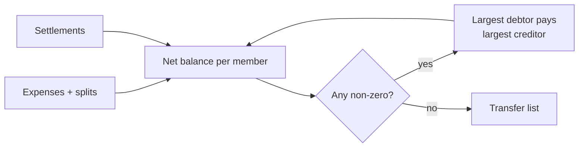
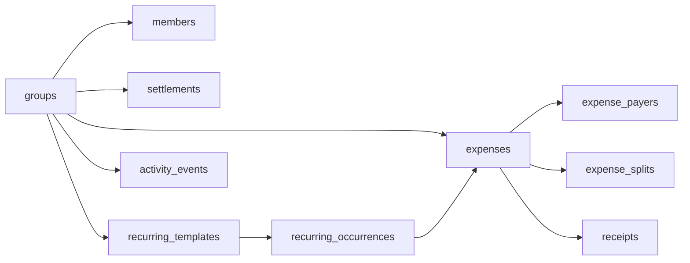
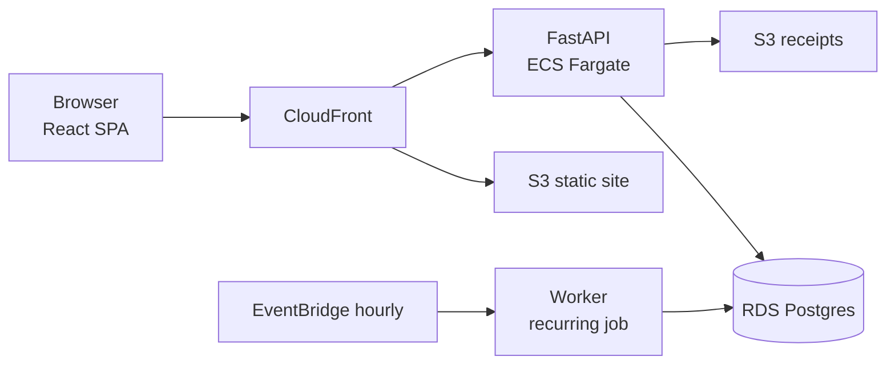

# SplitIt — Expense Splitter Spec

Sep 24, 2026 · @Juan David

## 1. Overview

SplitIt is a web app for splitting shared expenses in a group. People open a group from a secret link, with no sign-up. Any member can log an expense, choose who shares it and how it is split, and see who owes whom. The debts are simplified to the fewest possible transfers. It is also a portfolio project, so code quality, tests, CI/CD and infrastructure-as-code are in scope.

**Goals**

- Anyone joins a group in under 30 seconds: open the link, enter the PIN if one is set, pick "I am…".
- Every expense can be split among any subset of members, using one of four methods.
- Balances are always exact to the currency's minor unit. The sum of all balances is always 0.
- The app shows each member a short list of payments that settles the whole group.
- Every change is traceable in an activity log, and deleting an expense can be undone.

**Non-goals (v1)**

- User accounts, email or social login.
- Moving real money. Settlements are recorded, not paid, through the app.
- More than one currency in the same group, and currency conversion.
- Native mobile apps. v1 is a responsive web app (PWA-ready).
- Languages other than English.

**Decisions made**

| Topic | Decision |
| --- | --- |
| Split methods | Equal among selected members, exact amounts, percentages, shares/weights |
| Payers | An expense can have several payers, each with an amount |
| Debt view | Simplified: net balances turned into the fewest transfers |
| Currency | One per group, chosen when the group is created |
| Access | No login. A secret share link, plus an optional group PIN |
| Identity | On each device the user picks "I am…" from the member list, and the device remembers the choice |
| Editing | Anyone in the group can edit or delete. Every change is logged, and deletes can be undone |
| Extras in v1 | Settlements, categories, receipt photos, recurring expenses |
| Rounding | The payer absorbs any leftover minor units |
| Audience | Portfolio showcase |
| Stack | React (Vite) + FastAPI + PostgreSQL |
| UI language | English only |

## 2. Core concepts

| Term | Meaning |
| --- | --- |
| Group | A shared ledger with a name, a currency, members and a secret link. All money in a group uses its currency. |
| Member | A name inside a group, such as "Ana". It is not a user account. Anyone can add a member, and members are soft-removed. |
| Device identity | The member a browser has picked as "I am…" for a group. It is stored in a signed token on that device. It only labels actions; it is not a security boundary. |
| Expense | Money spent for the group. It has a total, one or more payers, and a split among participants. |
| Payer | A member who paid part of an expense. The amounts paid add up to the expense total. |
| Participant | A member who owes part of an expense. Their shares add up to the expense total. |
| Split method | How the total is divided among participants: `equal`, `exact`, `percent` or `shares`. |
| Settlement | A recorded payment from one member to another, such as "Luis paid Ana 50,000". It reduces debt. |
| Balance | For each member: total paid + settlements sent − total owed − settlements received. A positive balance means others owe you. |
| Suggested transfer | One payment in the simplified plan that brings everyone to 0. |
| Minor unit | The smallest unit of a currency: cents for USD and EUR. COP has 0 decimals in practice. All money is stored as an integer in minor units. |
| Recurring template | A rule that creates a new expense on a schedule, such as rent on the 1st of every month. |
| Activity event | An immutable record of a change: who made it, what changed, and the before and after values. |

## 3. Functional requirements

### 3.1 Groups

- **FR-G1** Anyone can create a group by entering a name, a currency (ISO 4217, e.g. COP, USD, EUR), their own member name, other members' names, and an optional PIN.
- **FR-G2** Creating a group returns a share link `/g/{slug}`. The slug is at least 128 bits of randomness (22+ URL-safe characters), so links cannot be guessed.
- **FR-G3** The currency cannot be changed once the group has its first expense.
- **FR-G4** Anyone in the group can rename the group, and set, change or remove the PIN.
- **FR-G5** Anyone can rotate the link. The old slug stops working at once. Rotating the link logs out every device and requires the PIN, if one is set.
- **FR-G6** A group can be archived, which makes it read-only, and unarchived. Deleting a group is a soft delete with a 30-day grace period.
- **FR-G7** The home page lists groups this browser has opened before, stored in local storage, so users can find them again without the link.

### 3.2 Access, PIN and identity

- **FR-A1** If a group has no PIN, opening the link grants access.
- **FR-A2** If a group has a PIN, the user must enter it once per device. On success the server issues an HTTP-only session cookie scoped to the group, valid for 90 days.
- **FR-A3** PIN attempts are limited to 5 per 15 minutes per IP and group. After that the user gets a 429 error with a retry time.
- **FR-A4** After access is granted, the user picks "I am…" from the list of members, or adds themselves. The chosen member ID goes into the device session.
- **FR-A5** The user can switch identity at any time from the header.
- **FR-A6** Every write request is attributed to the device's current member (the actor). A write with no identity picked is rejected with 409 `IDENTITY_REQUIRED`.

### 3.3 Members

- **FR-M1** Anyone can add members. Names must be unique within the group (case-insensitive) and 1–40 characters long.
- **FR-M2** Anyone can rename a member. Past records keep the member ID, so they show the new name.
- **FR-M3** A member can be removed only when their balance is 0. The member is then hidden from the pickers, but their history stays. Removing a member with a non-zero balance is blocked, and the app explains why.
- **FR-M4** An optional color or avatar initial per member, for quick recognition.

### 3.4 Expenses

- **FR-E1** Fields: description (1–120 characters), total amount (> 0), date (defaults to today), category (optional), notes (optional), receipt photos (0–3), payers, participants and split method.
- **FR-E2** Payers default to the current member paying the full amount. Users can add more payers with amounts. **Validation:** the payer amounts must add up to the total exactly.
- **FR-E3** Participants default to all active members. Users can select any subset of 1 or more members. A payer does not have to be a participant; for example, Ana can pay for Luis's and Marta's taxi.
- **FR-E4** Split methods, with the input and validation for each:

  | Method | User enters | Validation | Computed share |
  | --- | --- | --- | --- |
  | `equal` | Who takes part | ≥ 1 participant | total ÷ n, leftover per §4 |
  | `exact` | An amount per participant | Amounts add up to the total exactly | As entered |
  | `percent` | A percentage per participant, up to 2 decimals | Percentages add up to 100.00 | total × p, leftover per §4 |
  | `shares` | A positive whole number of shares per participant | ≥ 1 share in total | total × s ÷ Σs, leftover per §4 |
- **FR-E5** The form shows a live preview of each person's share, and a "remaining to assign" counter for the `exact` and `percent` methods.
- **FR-E6** The server stores the computed share in minor units for each participant (`expense_splits.owed_minor`) next to the raw input (`percent`, `shares`). Balances are computed only from the stored shares. This keeps old expenses stable if the rounding code changes later.
- **FR-E7** Anyone can edit any field. An edit recomputes the shares and writes an activity event with a before/after diff.
- **FR-E8** A delete is a soft delete. The app shows an "Undo" toast, and the expense can also be restored from the activity log.
- **FR-E9** The expense list is sorted by date (newest first). It can be filtered by category, member (paid or involved), date range and text search, and it paginates with a cursor.

### 3.5 Settlements

- **FR-S1** Any member can record "X paid Y" with an amount, a date and an optional note. Partial amounts are allowed.
- **FR-S2** Each suggested transfer has a one-tap "Mark as paid" button. It pre-fills a settlement, and the user can edit the amount.
- **FR-S3** Settlements can be edited, deleted and undone, like expenses. They also appear in the activity log.
- **FR-S4** Paying more than you owe is allowed but triggers a warning. The balance then flips sign; for example, Y now owes X.

### 3.6 Balances and "who owes whom"

- **FR-B1** The group dashboard shows each member's net balance ("gets back 120,000" or "owes 45,500") and the list of suggested transfers.
- **FR-B2** A personal view for the current member: "You owe Ana 30,000" and "Luis owes you 12,000", taken from the suggested transfers that involve them.
- **FR-B3** Clicking a member shows the breakdown behind their balance: every expense and settlement that affects them, with the amount.
- **FR-B4** Balances and transfers are computed on read. With the volumes a group has (< 10k expenses) this is fast enough, and nothing can go stale. See §4.

### 3.7 Categories and receipts

- **FR-C1** A fixed default list of categories: Food & drink, Groceries, Transport, Lodging, Utilities, Rent, Entertainment, Shopping, Health, Other. Groups can add their own categories.
- **FR-C2** Receipts: JPEG, PNG, WebP or HEIC files up to 10 MB, at most 3 per expense. They are uploaded straight to object storage with a pre-signed URL and resized to thumbnails on the server. Receipts can only be viewed through short-lived signed URLs.

### 3.8 Recurring expenses

- **FR-R1** Any expense can be saved as recurring, with a frequency (weekly, monthly or yearly, every N periods), a start date and an optional end date or number of occurrences.
- **FR-R2** A scheduler runs every hour. It creates the expenses that are due as normal expenses and links each one to its template. The job is idempotent, keyed on (template, occurrence date).
- **FR-R3** Editing a template changes future occurrences only. Occurrences already created can be edited like any other expense.
- **FR-R4** Templates can be paused, resumed and deleted. Monthly templates set on day 29–31 fall back to the last day of shorter months.

### 3.9 Activity log

- **FR-L1** Every create, update, delete and restore of a group, member, expense, settlement or template writes an append-only event with the actor, a timestamp, the entity, the action and a JSON before/after diff.
- **FR-L2** A group-wide feed in plain language, e.g. "Ana changed 'Dinner' from 90,000 to 96,000 · 2h ago", which can be filtered by member and type.
- **FR-L3** A "Restore" button on delete events. Restoring writes a new event; it does not rewrite history.

## 4. Money, rounding and debt simplification

All amounts are integers in minor units, and all maths is integer maths. The code never uses floats. Balances in a group always add up to exactly 0.

### 4.1 Minor units

- Each currency's exponent is taken from ISO 4217: USD and EUR use 2, COP uses 2 officially. **Open question:** should COP be treated as having 0 decimals in the UI? (Recommended: yes. Store COP with exponent 0.)
- Percentages are stored as integer basis points (100% = 10,000).

### 4.2 Computing shares ("payer absorbs")

1. Compute the raw share for each participant *i*, rounded down (floor):
   - equal: `floor(T / n)`
   - percent: `floor(T × bp_i / 10000)`
   - shares: `floor(T × s_i / Σs)`
   - exact: as entered, with no leftover
2. Leftover `r = T − Σ share_i`. For the equal method, 0 ≤ r < n.
3. **The payer absorbs r.** The primary payer is the payer with the largest paid amount; ties go to the lowest member ID. Add r to the primary payer's owed amount. If the primary payer is not a participant, add a split row for them with `owed = r` and `is_rounding = true`.
4. Result: Σ owed = Σ paid = T, always. The payer is never shortchanged by more than n−1 minor units.

### 4.3 Net balance

```latex
B_m = \sum \text{paid}_m - \sum \text{owed}_m + \sum \text{settle\_sent}_m - \sum \text{settle\_recv}_m
```

B > 0 means the group owes member m. B < 0 means m owes the group. The code asserts Σ B = 0; if that ever fails, it is a bug and gets logged loudly.

### 4.4 Simplifying debts

A greedy algorithm, deterministic and O(n log n):

1. Split members into creditors (B > 0) and debtors (B < 0). Ignore members at 0.
2. Repeat: take the largest creditor C and the largest debtor D. Ties go to the lowest member ID, so the output is stable. Transfer `x = min(B_C, |B_D|)` from D to C, then update both balances.
3. Stop when all balances are 0. This gives at most n−1 transfers.

Finding the true minimum number of transfers is NP-hard (it is a subset-sum problem). Greedy is optimal or close to optimal for groups of the size SplitIt targets. A possible later enhancement: detect zero-sum subgroups exactly when there are 12 or fewer non-zero members.



### 4.5 Worked example (COP, exponent 0)

Members: Ana, Luis, Marta, Juan.

| Expense | Total | Paid by | Split | Owed |
| --- | --- | --- | --- | --- |
| Dinner | 100,000 | Ana 100,000 | equal: Ana, Luis, Marta | Ana 33,334 (absorbs 1), Luis 33,333, Marta 33,333 |
| Taxi | 30,000 | Luis 30,000 | equal: Marta, Juan | Marta 15,000, Juan 15,000 |
| Groceries | 120,000 | Ana 80,000 + Juan 40,000 | shares 2:1:1:2 | Ana 40,000, Luis 20,000, Marta 20,000, Juan 40,000 |

| Member | Paid | Owed | Balance |
| --- | --- | --- | --- |
| Ana | 180,000 | 73,334 | +106,666 |
| Luis | 30,000 | 53,333 | −23,333 |
| Marta | 0 | 68,333 | −68,333 |
| Juan | 40,000 | 55,000 | −15,000 |

The balances add up to 0. The suggested transfers are: Marta → Ana 68,333; Luis → Ana 23,333; Juan → Ana 15,000. That is 3 transfers, the n−1 maximum for 4 members. Everyone pays only Ana, even though Luis paid for Marta's and Juan's taxi. This example should be a golden test case (see §8).

### 4.6 Edge cases to handle

- Editing an old expense after people have settled up. Balances are recomputed, and new transfers may appear. The UI flags "balances changed since your last visit".
- A member with a 0 balance but a long history can be removed (FR-M3).
- Very large totals: store amounts as BIGINT. The UI caps an expense at 10^12 minor units.
- An expense whose only participant is its only payer is allowed but has no effect on balances. The UI shows a hint.

## 5. Data model (PostgreSQL)

Primary keys are UUIDv7. Every money column is a `BIGINT` in minor units. Every table has `created_at`, `updated_at` and `deleted_at` (soft delete), except `activity_events`, which is append-only. Optimistic locking uses a `version INT` column on editable rows.

| Table | Key columns | Notes |
| --- | --- | --- |
| `groups` | id, slug (unique), name, currency\_code, currency\_exponent, pin\_hash (nullable), archived\_at, version | The slug can be rotated. The PIN is hashed with argon2id. |
| `members` | id, group\_id, name, color, removed\_at | Unique (group\_id, lower(name)) among active members |
| `device_sessions` | id, group\_id, member\_id (nullable), token\_hash, expires\_at, last\_seen\_at | One row per browser. Deleted when the slug rotates or the PIN changes. |
| `categories` | id, group\_id (null means a default), name, icon |  |
| `expenses` | id, group\_id, description, total\_minor, spent\_on (date), category\_id, notes, split\_method, recurring\_template\_id, created\_by\_member\_id, version |  |
| `expense_payers` | expense\_id, member\_id, paid\_minor | PK (expense\_id, member\_id). The paid amounts add up to total\_minor. |
| `expense_splits` | expense\_id, member\_id, input\_bp, input\_shares, input\_exact\_minor, owed\_minor, is\_rounding | PK (expense\_id, member\_id). The owed amounts add up to total\_minor. |
| `settlements` | id, group\_id, from\_member\_id, to\_member\_id, amount\_minor, settled\_on, note, version | CHECK from ≠ to, amount > 0 |
| `receipts` | id, expense\_id, storage\_key, thumb\_key, mime, bytes | At most 3 per expense (enforced in the app) |
| `recurring_templates` | id, group\_id, payload JSONB (expense shape), freq, interval, by\_month\_day, starts\_on, ends\_on, max\_count, next\_run\_on, paused\_at |  |
| `recurring_occurrences` | template\_id, occurs\_on, expense\_id | PK (template\_id, occurs\_on) makes the scheduler idempotent |
| `activity_events` | id, group\_id, actor\_member\_id, entity\_type, entity\_id, action, diff JSONB, created\_at | Indexed on (group\_id, created\_at DESC) |

**Integrity rules**

- The totals of payers and splits are checked in the service layer. A deferred constraint trigger checks them again at commit time.
- Every member referenced by a payer, split or settlement must belong to the same group. This is enforced with composite foreign keys on (group\_id, member\_id).
- Writing an expense, its payers, splits and activity event happens in one transaction.



## 6. REST API (FastAPI, `/api/v1`)

All group routes are scoped by the slug: `/api/v1/g/{slug}/…`. Authentication is the group session cookie, which is required when the group has a PIN. The actor is the `member_id` stored in that session. Errors use RFC 9457 problem+json with a stable `code`. Edits send `If-Match: <version>`; if the version is stale, the server answers 412.

| Method | Path | Purpose |
| --- | --- | --- |
| POST | `/groups` | Create a group, its members and an optional PIN. Returns the slug and a session. |
| GET | `/g/{slug}` | Group metadata, members and whether a PIN is required |
| PATCH | `/g/{slug}` | Rename, archive, or change the PIN |
| POST | `/g/{slug}/rotate-link` | Get a new slug and revoke every session |
| POST | `/g/{slug}/session` | Submit the PIN and get a cookie. Rate-limited. |
| PUT | `/g/{slug}/session/identity` | Set "I am…" (member\_id) |
| POST / PATCH / DELETE | `/g/{slug}/members[/{id}]` | Add, rename or remove a member |
| GET | `/g/{slug}/expenses?cursor&category&member&from&to&q` | List expenses |
| POST | `/g/{slug}/expenses` | Create an expense (see the body below) |
| GET / PATCH / DELETE | `/g/{slug}/expenses/{id}` | Read, edit or soft-delete an expense |
| POST | `/g/{slug}/expenses/{id}/restore` | Undo a delete |
| POST | `/g/{slug}/expenses/preview-split` | Compute the shares without saving, for the live preview in the form |
| POST | `/g/{slug}/expenses/{id}/receipts/upload-url` | Get a pre-signed PUT URL |
| GET / POST / PATCH / DELETE | `/g/{slug}/settlements[/{id}]` | Settlements CRUD |
| GET | `/g/{slug}/balances` | Net balance per member and the suggested transfers |
| GET | `/g/{slug}/balances/{member_id}` | The breakdown behind one member's balance |
| GET / POST / PATCH / DELETE | `/g/{slug}/recurring[/{id}]` | Templates CRUD, plus pause and resume |
| GET | `/g/{slug}/activity?cursor&member&type` | The activity feed |
| GET / POST | `/g/{slug}/categories` | List and add categories |

Example request body for creating an expense:

```json
{
  "description": "Groceries",
  "total_minor": 120000,
  "spent_on": "2026-09-20",
  "category_id": "…",
  "payers": [{"member_id": "ana", "paid_minor": 80000}, {"member_id": "juan", "paid_minor": 40000}],
  "split": {"method": "shares", "participants": [
    {"member_id": "ana", "shares": 2}, {"member_id": "luis", "shares": 1},
    {"member_id": "marta", "shares": 1}, {"member_id": "juan", "shares": 2}]}
}
```

The `/balances` response returns `members: [{member_id, paid, owed, sent, received, balance}]`, `transfers: [{from, to, amount_minor}]`, and `computed_at`.

## 7. Architecture, security and NFRs

The backend is a modular FastAPI monolith with Postgres, and a separate worker runs the recurring-expense job. The frontend is a React SPA. It all deploys to AWS with Terraform. For a portfolio project, a clean monolith with explicit domain boundaries shows more judgment than microservices would.



### 7.1 Stack

| Layer | Choice |
| --- | --- |
| Frontend | React 19 + TypeScript + Vite, TanStack Query, React Hook Form + Zod, Tailwind + shadcn/ui, PWA manifest |
| API client | Generated from the FastAPI OpenAPI schema (openapi-typescript), so types are shared end to end |
| Backend | Python 3.12, FastAPI, Pydantic v2, SQLAlchemy 2.0 (async) + Alembic, uv for dependencies |
| Domain core | A pure-Python `ledger` package holding split, rounding and simplification logic, with no I/O. Easy to test and to show off. |
| Database | PostgreSQL 16 |
| Storage | S3 for receipts, with pre-signed URLs; thumbnails are made with Pillow |
| Jobs | A worker container triggered by an EventBridge schedule |
| Infrastructure | Terraform: VPC, ECS Fargate, RDS, S3, CloudFront, ACM, Secrets Manager |
| Observability | Structured JSON logs, OpenTelemetry traces to CloudWatch/X-Ray, Sentry for errors |
| Local development | docker-compose (API, Postgres, MinIO), a seed script with the §4.5 example |

### 7.2 Security (with no login, the link is the key)

- Slugs have 128+ bits of entropy. Responses include `Referrer-Policy: no-referrer` so the slug does not leak. A `noindex` meta tag keeps groups out of search engines.
- PINs are 4–8 digits, hashed with argon2id, and rate-limited (FR-A3). Session tokens are random, stored only as a hash, and sent in HttpOnly, Secure, SameSite=Lax cookies.
- State-changing requests are protected against CSRF by the SameSite cookie plus a custom header. CORS is locked to the app's origin.
- Any member can pick any identity, so the activity log is the accountability mechanism. The UI states this plainly.
- All input is validated with Pydantic. Receipt uploads are checked for MIME type and size, EXIF data is stripped, and receipts are served only through short-lived signed URLs.
- API-wide rate limit per IP, e.g. 120 requests per minute.
- Privacy: no personal data beyond the display names members type in. Deleted groups are purged after 30 days.

### 7.3 Non-functional requirements

| Area | Target |
| --- | --- |
| Performance | `/balances` p95 < 150 ms for 5,000 expenses and 30 members; page load LCP < 2.5 s on 4G |
| Correctness | Σ balances = 0 is checked on every computation; property-based tests (§8) |
| Concurrency | Optimistic locking; two people editing the same expense get a 412 error and a merge prompt |
| Availability | Best effort (single region); daily RDS snapshots kept for 7 days |
| Accessibility | WCAG 2.2 AA, keyboard-friendly forms, amounts in `tabular-nums` |
| Responsiveness | Mobile first, from 360 px wide; adding an expense takes 3 taps or fewer for the default case |
| Formatting | Amounts are shown with the currency's symbol and grouping (Intl.NumberFormat) |
| Cost | Under about $30 per month idle; the portfolio can scale down to a single Fargate task |

## 8. Testing, CI/CD and delivery

### 8.1 Testing

- **Domain unit tests** (pytest) for the `ledger` package: every split method, the rounding rule, multiple payers, and the §4.5 golden example.
- **Property-based tests** (Hypothesis) with random groups and expenses. Invariants: Σ owed = total for every expense; Σ balances = 0; applying the suggested transfers zeroes every balance; there are at most n−1 transfers; the output is deterministic.
- **API tests** use httpx against a real Postgres (Testcontainers). They cover the validation errors, the PIN rate limit, 412 on a stale version, soft delete and restore, and idempotency of the recurring job.
- **Frontend tests**: Vitest and Testing Library for the expense form's validation and the live preview. Playwright end-to-end tests cover creating a group, sharing it, adding an expense with a custom split, and settling up.
- Coverage gate: at least 90% on `ledger` and at least 80% overall.

### 8.2 CI/CD (GitHub Actions)

1. On every pull request: lint (ruff, mypy, eslint, tsc), unit and property tests, API tests, the Playwright smoke test, and `terraform plan`.
2. On merge to main: build the images and push them to ECR, run the Alembic migration as a one-off task, deploy to ECS with a rolling update, and sync the SPA to S3 and invalidate CloudFront.
3. A preview environment per pull request (optional, a later stretch goal).

### 8.3 Milestones

| # | Milestone | Scope |
| --- | --- | --- |
| M1 | Ledger core | The `ledger` package, property tests, the golden example |
| M2 | Groups and access | Groups, members, slug, PIN, sessions, "I am…", DB schema, migrations |
| M3 | Expenses and balances | Expense CRUD with all four split methods and multiple payers, balances, transfers, the dashboard UI |
| M4 | Settlements and activity | Settlements, "Mark as paid", activity log, undo and restore |
| M5 | Extras | Categories, receipts (S3), recurring templates and the worker |
| M6 | Ship | Terraform, CI/CD, observability, README with architecture diagrams, and a demo group seeded with data |

## 9. Open questions

- [ ] Should COP be shown with 0 decimals? (Recommended: yes.)
- [ ] Should a PIN be required for destructive actions, such as deleting a group or rotating the link, even when the group has no PIN set?
- [ ] Should a removed member's past expenses keep their name, or show "Former member"?
- [ ] Should recurring expenses be created automatically, or suggested for someone to confirm first?
- [ ] Should the group get notifications (email or web push) when something changes? This needs some contact info, which conflicts with the no-login model.
- [ ] Should the app have a public demo mode (a read-only group, reset every night) for recruiters?

## 10. Later (out of v1)

- Export to CSV or Excel, and charts of spending by category and by person.
- Multiple currencies in one group, with rate snapshots taken on the expense date.
- An optional account that collects all of a person's groups across devices.
- Scanning receipts with OCR or an LLM to prefill the amount and description. A natural fit for your GenAI background.
- Payment deep links, e.g. Bre-B, Nequi or PayPal, pre-filled from the suggested transfers.
- Offline-first PWA with a queue of pending writes.
- A toggle between the pairwise view and the simplified view.
